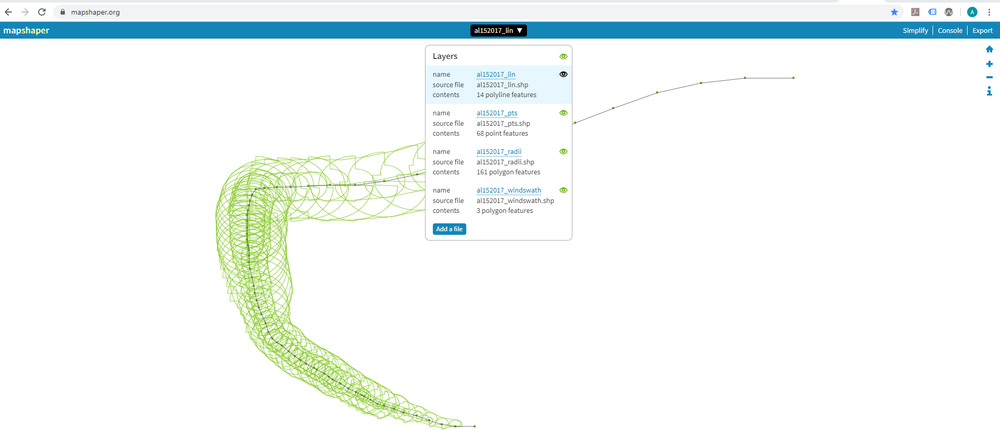
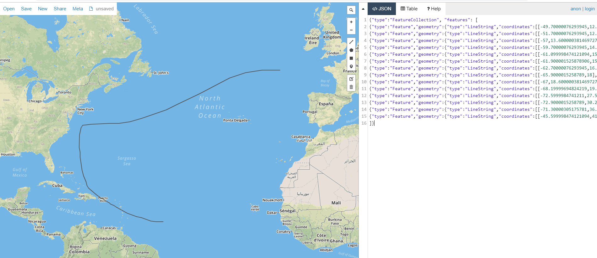

# How to Get Sample Data for Hurricanes

So let's say you want to make a visualization about hurricanes; you are going to need some data. Here's how to get some

## Find Historical Hurricane Data
[The National Hurricane Center and Central Pacific Hurricane Center](https://www.nhc.noaa.gov/data/tcr/index.php?season=2018&basin=atl) is a good resource.

On the The National Hurricane Center and Central Pacific Hurricane Center site you can find historic data 
for hurricanes dating back to 1995. However not all the years have data in an easily accessible format. 

Starting in 2015 The National Hurricane Center and Central Pacific Hurricane Center has posted hurricane 
data in 'SHP' (shapefile format). Using a shapefile gives us access to a data set containing a number of 
important facts related to the hurricane of our choice. One of the more basic bits of information contained
in the shapefile is the hurricane line.  

Downloading a shapefile will deliver a compressed folder to your computer called something like 'al022015_best_track.zip'.
At this point you ready to convert the files to GeoJson. 

Go to [Mapshaper.org](https://mapshaper.org). On the at Mapshaper.org main page (there is only one page) you will see 'select'
button that will allow you to choose a shapefile from your local computer. When the file browser pops up, select the shapefile
folder and hit open. The screen will jump back to Mapshaper and present a dialog box with a list of all the files in the 
folder. This will allow you to preview all of the layers in the shapefile. For any given hurricane shapefile there will be 
four layers.
```
Hurricane Shapefile Content Layers
- line 
- points
- radii
- windswath
``` 


Mapshaper will also allow you to convert the various layers seen above into GeoJson. To do this, first make sure
that the compressed shapefile folder has been uncompressed. Then repeat the same step as above, except select the 
uncompressed folder. This will allow you to select individual files from the folder. 

Select a shapefile, '.shp', from your recently uncompressed folder. Mapshaper will display this file on the screen.
It will also show a button (link) at the top right corner called 'export'. Selecting this 'export' link will give you a 'Export Menu'
from which you can select the file type into which you want convert the shapefile. Selecting GeoJSON and then hitting
the 'Export' button will allow you to send the file to your local system.

Once you have, what you think is a, shiny new GeoJSON file, you can confirm the contents by using [geojson.io](http://geojson.io).
Once on Geojson.io you can copy the contents of your new file to the right hand panel. Geojson.io will display the 
contents of your file on the map (provided it is valid GeoJSON).
