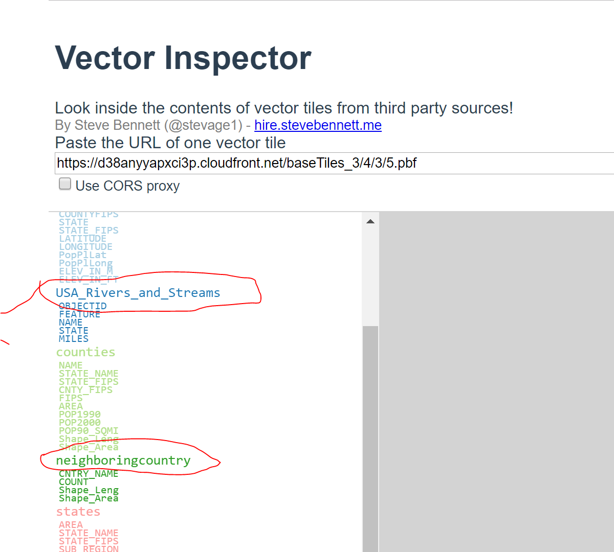

# Vector Inspector
How do you know the name of the 'source-layer?' Well, it is not totally straight-forward. A way that works is to use a handy
program called, Vector Inspector https://stevage.github.io/vector-inspector/ . 'Vector Inspector' will give the name of
the 'source-layer' as shown circled in the image below. 
